## docsify介绍

- Docsify即时生成您的文档网站。与 GitBook 不同，它不会生成静态 html 文件。相反，它会智能地加载和解析您的 Markdown 文件，并将它们显示为网站。


- docsify官方文档入口:[https://docsify.js.org/](https://docsify.js.org/)


## docsify安装及初始化

> step1:安装Node.js

搜索进入官网，点击下载，选择windows install (.msi) 64-bit

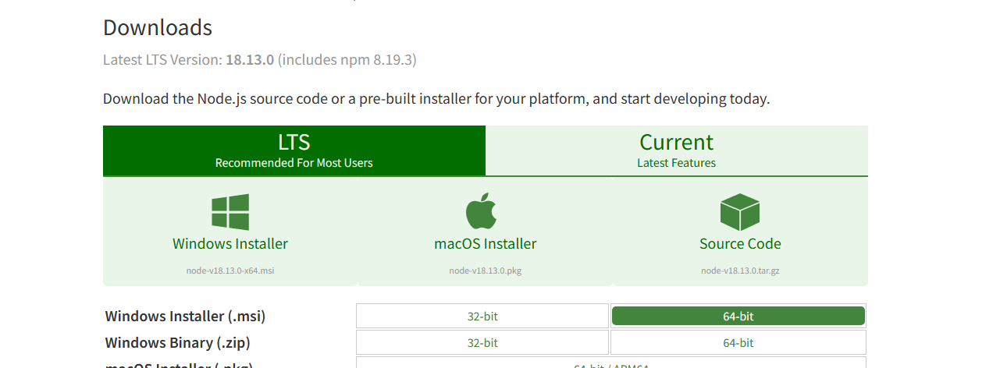

> step2:安装docsify工具包

打开命令提示符`win+r`，输入`cmd`

输入`npm i docsify-cli -g`，推荐全局安装

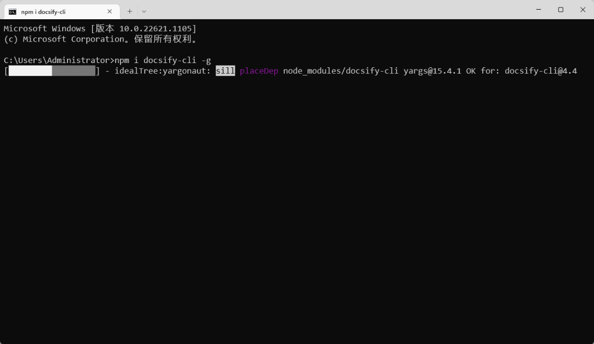


> step3:初始化

切换到想初始化的目录，输入`docsify init`进行初始化

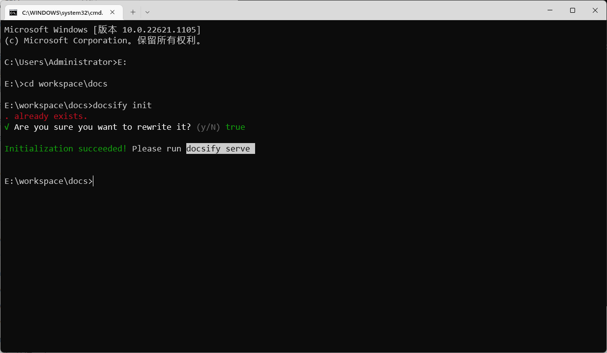

打开文件夹查看

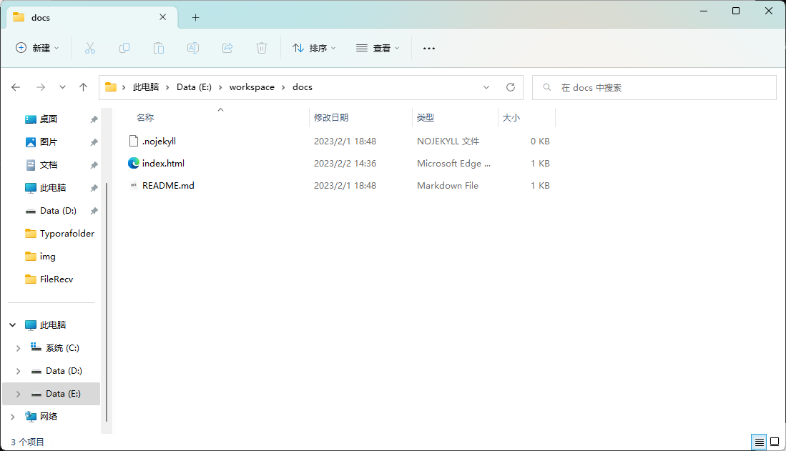


## 开始编写

### 准备工作

- 使用vs code打开docs目录

- 在终端中输入`docsify serve ./docs`运行本地服务器。可以在浏览器中预览网站

> 注意：要在上级文件夹中输入命令

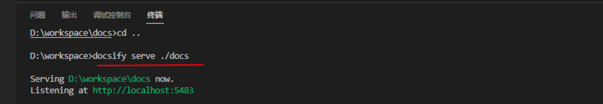


- 在`README.md`文件中输入`hello docsify`可以显示出表示成功！

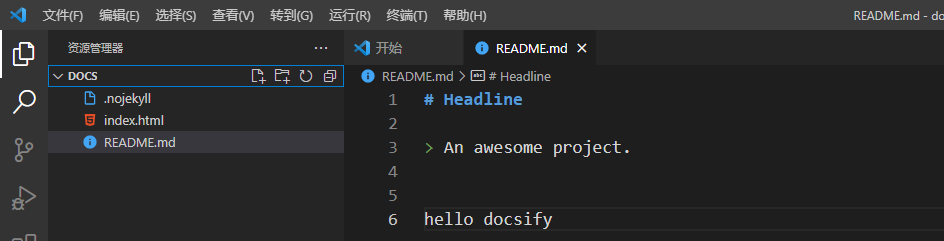

效果如下


### 多页文档

- 如果您需要更多页面，只需在docsify目录中创建更多md文件即可。
- 在要实现跳转的md文件中，输入`[显示的名称](链接/文件)`

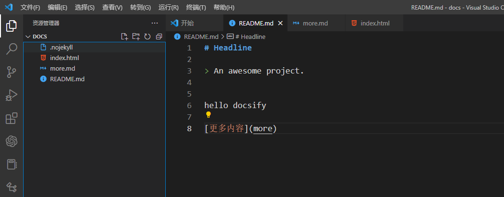

在`more.md`中输入内容

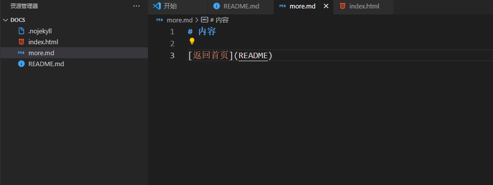

最终显示效果


### 侧边栏

- 侧边栏的设置首先创建一个`_sidebar.md`文件，写入：

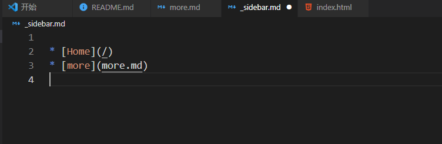

- 然后在`index.html`中添加`loadSidebar:true`

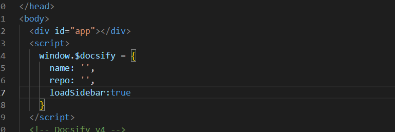

- 设置成功

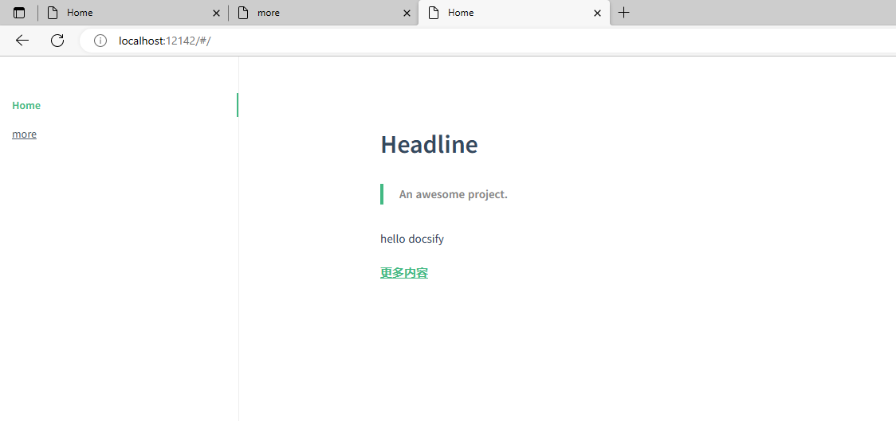

### 导航栏

- 导航栏的创建和侧边栏类似，创建`_navbar.md`文件，然后输入：

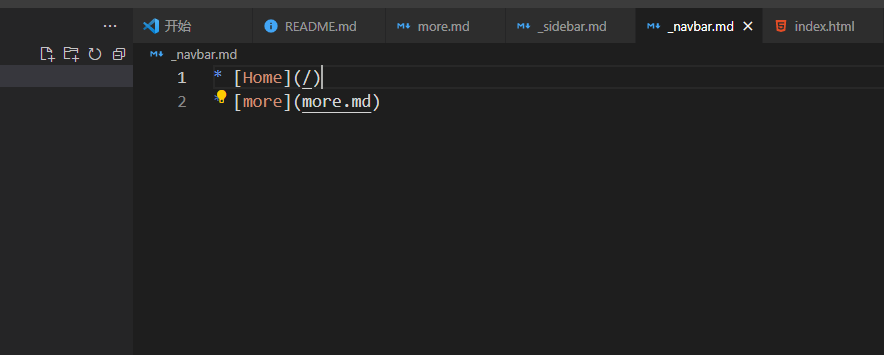

- 在`index.html`中添加`loadNavbar: true`

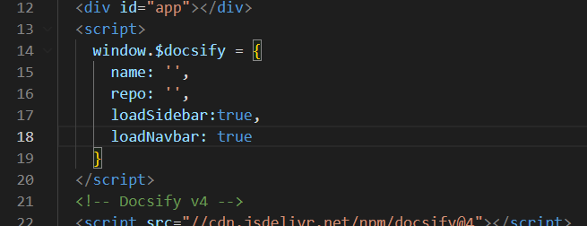

- 设置成功


### 多级目录

- 创建文件夹，用于存放不同的笔记

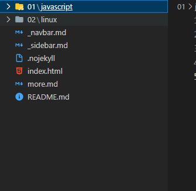

- 然后在各个子目录中创建`README.md`文件，该文件是笔记内容

  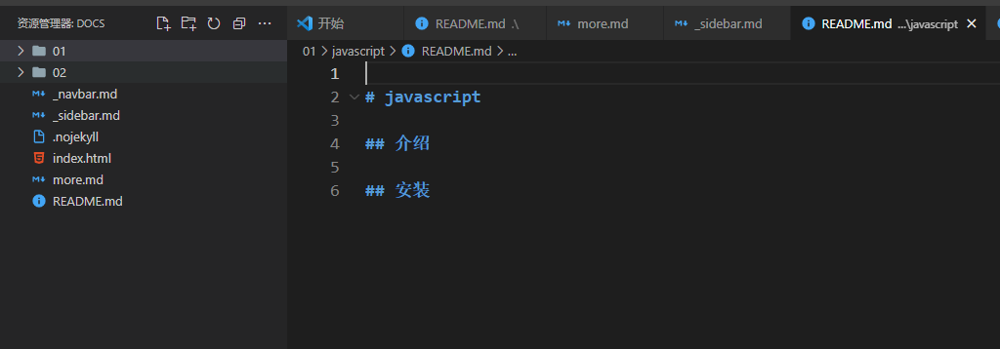


- `_sidebar.md`或`_navbar.md`中写入多级目录

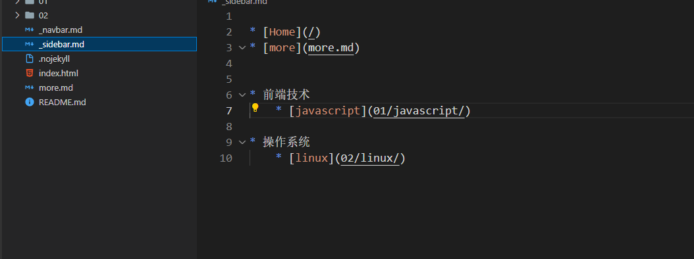

- 页面效果

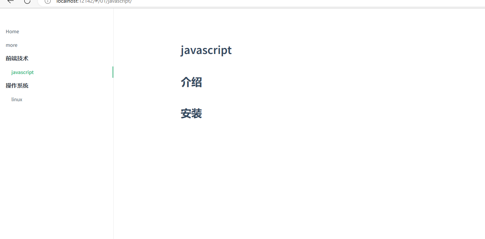

### 封面

- 通过将`coverpage: true`来激活封面功能

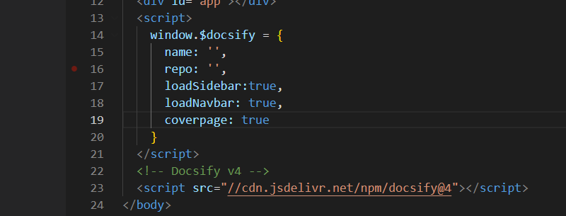

- 创建一个`_coverpage.md`，写入内容。如官方文档：

```markdown
<!-- _coverpage.md -->


# docsify <small>3.5</small>

> A magical documentation site generator.

- Simple and lightweight
- No statically built html files
- Multiple themes

[GitHub](https://github.com/docsifyjs/docsify/)
[Get Started](#docsify)
```

- 封面如下：

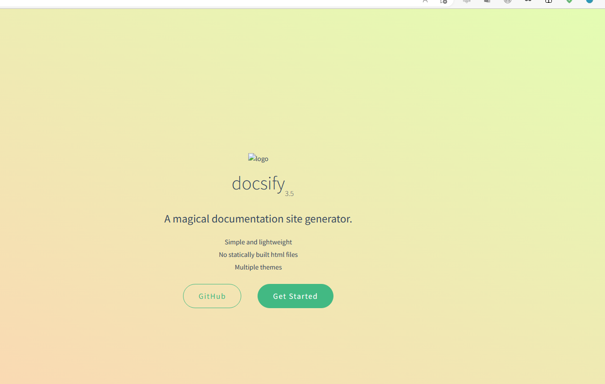

## 部署

### 简介

- 编写完成后，只是本地服务器可以访问。若想实现互联网访问，就要将`docs`文件部署到服务器上
- 这里我们使用Github page来部署

### 详细步骤

> step1:创建仓库

打开[Github page](https://pages.github.com)，注意仓库的命名格式是`username.github.io`


> step2:克隆本地

在目的文件夹中进行克隆到本地

创建成功后，复制Https


> step3:上传

将文件夹`docs`复制到`hiraeth.github.io`文件中

git操作将文件上传到远程仓库

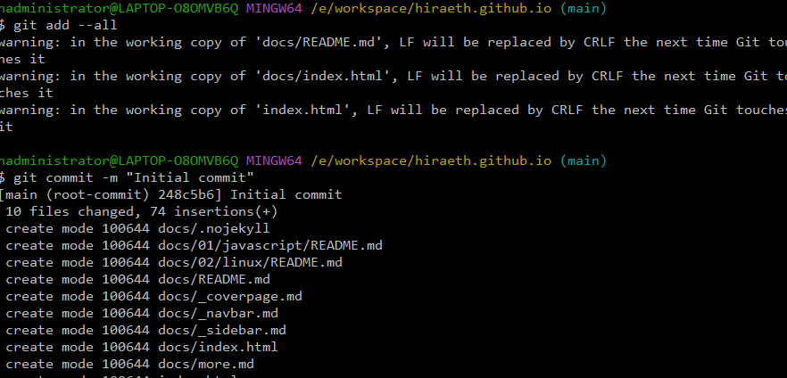

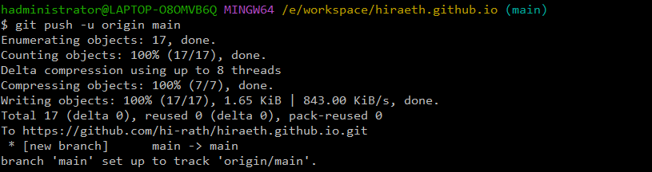

在github中点击Pages，在Branch中保存

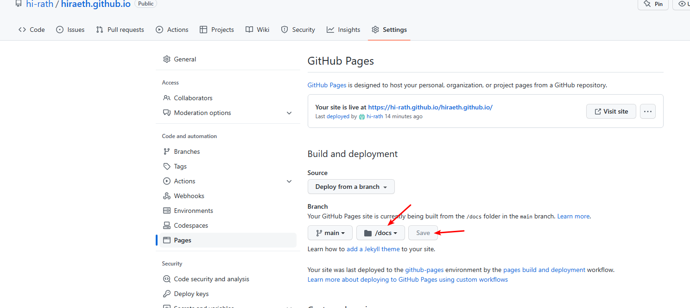

基本实现博客创建