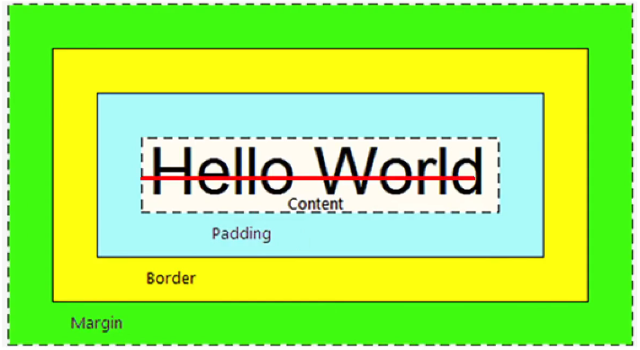

# html

### 一、基础认知

##### 1.1.1 认识网页(了解)

问题1：网页由哪些部分组成？

文字、图片、音频、视频、超链接

问题2：我们看到的网页背后本质是什么？

前端程序员的代码

问题3：前端的代码是通过什么软件转换成用户眼中的页面的？

通过浏览器（解析和渲染）成用户看到的页面

##### 1.2.2 渲染引擎(了解)

渲染引擎（浏览器内核）：浏览器中专门对代码进行解析渲染的部分

浏览器出品的公司不同，内在的渲染引擎也是不同的：

| 浏览器       | 内核    | 备注                                |
| ------------ | ------- | ----------------------------------- |
| IE           | Trident | IE、猎豹安全、360浏览器、百度浏览器 |
| FireFox      | Gecko   | 火狐浏览器内核                      |
| Safari       | Webkit  | 苹果浏览器内核                      |
| Chrome/Opera | Blink   | Blink其实是Webkit的分支             |

注意点：渲染引擎不同，导致解析相同代码的速度、性能、效果也不同的

##### 1.3.2 Web标准的构成

Web标准中分成三个构成：

| 构成 |    语言    |                         说明                         |
| :--: | :--------: | :--------------------------------------------------: |
| 结构 |    HTML    |                  **页面元素**和内容                  |
| 表现 |    CSS     | 网页元素的外观和位置等**页面样式**(如：颜色、大小等) |
| 行为 | JavaScript |             网页模型的定义与**页面交互**             |

##### 2.1.1 HTML的概念

HTML（Hyper Text Markup Language）中文译为：超文本标记语言

​	专门用于网页开发的语言，主要通过HTML标签对网页中的文本、图片、音频、视频等内容进行描述

案例：文字变粗案例

##### 2.2.1 HTML页面固定结构

网页类似于一篇文章：

​		每一页文章内容有固定的结构的，如：开头、正文、落款等

​		网页中也是存在固定的结构的，如：整体、头部、标题、主体

**在vscode中输入英文叹号`!`可快速创建结构**

网页中的固定结构是要通过特定的**HTML标签**进行描述

```html
<html>
    <head>
        <title>网页的标题</title>
    </head>
    <body>
        网页的主体内容
    </body>
</html>
```

##### 3.2.1 HTML标签的结构

标签的结构图：


结构说明：

1.标签由<、>、/、英文单词或字母组成。并且把标签中<>包括起来的英文单词或字母称为标签名

2.常见标签由两部分组成，我们称之为：双标签，前部分叫开始标签，后部分叫结束标签，两部分之间包裹内容

3.少数标签由一部分组成，我们称之为：单标签。自成一体，无法包裹内容。

##### 3.4.1 HTML标签与标签之间的关系可分为：

父子关系（嵌套关系）

```html
<head>
	<title></title>
<head>
```

兄弟关系（并列关系）

```html
<head></head>
<body></body>
```


### 二、HTML标签学习

#### 1.排版标签

##### 1.3.1 换行标签

- 场景：让文字强制换行显示


- 代码：`<br>`


- 语义：换行


- 特点：


​			单标签

​			让文字强制换行

##### 1.4.1 水平线标签

- 场景：分割不同主题内容的水平线


- 代码：`<hr>`


- 语义：主题的分割转换


- 特点：


​			单标签

​			在页面中显示一条水平线

#### 2.文本格式化标签

##### 2.1 文本格式化标签的介绍

- 场景：需要让文字加粗、下划线、倾斜、删除线等效果


- 代码：


| 标签 | 说明   |
| ---- | ------ |
| b    | 加粗   |
| u    | 下划线 |
| i    | 倾斜   |
| s    | 删除线 |

---

| 标签   | 说明   |
| ------ | ------ |
| strong | 加粗   |
| ins    | 下划线 |
| em     | 倾斜   |
| del    | 删除线 |

- 语义：突出重要性的强调语境


#### 2.2 标签语义化（了解）

实际项目开发中选择标签的原则：标签语义化

​	即：根据语义选择对应正确的标签

​	如：需要写标题，就使用h系列标签；需要写段落，就使用p标签

推荐：

​	strong、ins、em、del表示的强调语义更强烈

#### 3.媒体标签

##### 3.1.1 图片标签的介绍

- 场景：在网页中显示图片


- 代码：``


- 特点：


​			单标签

​			img标签展示对应的效果，需要借助标签的属性进行设置！

- 标签的完整结构图：


- 属性注意点：


1.标签的属性写在开始标签内部

2.标签上可以同时存在多个属性

3.属性之间以空格隔开

4.标签名与属性之间必须以空格隔开

5.属性之间没有顺序之分

##### 3.1.4 图片标签的title属性

- 属性名：title


- 属性值：提示文本


​			当鼠标悬停时，才显示文本

- 注意点：title属性不仅仅可以用于图片标签，还可以用于其他标签


##### 3.1.5 图片标签的width和height属性

- 属性名：width和height


- 属性值：宽度和高度(数字)


- 注意点：
  - 如果只设置width或height中的一个，另一个没设置的会自动等比例缩放(此时图片不会变形)
  - 如果同时设置了width和height两个，若设置不当此时图片可能会变形

##### 3.2.2 绝对路劲（了解）

- 绝对路径：指目录下的绝对位置，可直接到达目标位置，通常从盘符开始的路劲
- 例如：
  - 盘符开头：D:\day01\imags\1.jpg
  - 完整的网络地址：https://www.itcast.cn/2013cad/logo.gif

##### 3.2.4 相对路径-同级目录

- 同级目录：当前文件和目标文件在同一个目录中
- 表示方式：
  - 方法一：`"`
  - 方法二：`"`


##### 3.2.5 相对路径-下级目录

- 下级目录：目标文件在下级目录中
- 表示方式：`</audio>`
- 常见属性：

| 属性名   | 功能                         |
| -------- | ---------------------------- |
| src      | 音频的路径                   |
| controls | 显示播放的控件               |
| autoplay | 自动播放（部分浏览器不支持） |
| loop     | 循环播放                     |

- 注意点：
  - 音频标签目前支持三种格式：mp3、wav、ogg

##### 3.4.1 视频标签的介绍

- 场景：在页面中插入视频
- 代码：`<video src="" controls></video>`
- 常见属性

| 属性名   | 功能                                            |
| -------- | ----------------------------------------------- |
| src      | 视频的路径                                      |
| controls | 显示播放的控件                                  |
| autoplay | 自动播放（谷歌浏览器中需配合muted实现静音播放） |
| loop     | 循环播放                                        |

- 注意点：
  - 视频标签目前支持三种格式：mp4、webm、ogg


#### 4.链接标签

##### 4.1 链接标签的介绍

- 场景：点击之后，从一个页面跳转到另一个页面
- 代码：`<a href="./目标网页.html">超链接</a>`
- 特点：
  - 双标签，内部可以包裹内容
  - 如果需要a标签点击之后去指定页面，需要设置a标签的href属性

```html
<!DOCTYPE html>
<html lang="en">
<head>
    <meta charset="UTF-8">
    <meta http-equiv="X-UA-Compatible" content="IE=edge">
    <meta name="viewport" content="width=device-width, initial-scale=1.0">
    <title>Document</title>
</head>
<body>
    <a href="https://www.baidu.com">百度</a>
    <br>
    <!-- 当开发网站初期，我们还不知道跳转地址的时候，href的值书写#（空链接）-->
    <a href="#">空链接</a>
</body>
</html>
```


##### 4.4 链接标签的target属性

- 属性名：target
- 属性值：目标网页的打开形式
- 取值：
  - `_self`  默认值，在当前窗口中跳转（覆盖原网页）
  - `_blank`  在新窗口中跳转（保留原网页）

`<a href="https://www.baidu.com" target="_blank">百度</a>`

### 三、列表标签


#### 2.1 无序列表

- 场景：在网页中表示一组无顺序之分的列表，如：新闻列表。
- 标签组成：
  - `ul` 表示无序列表的整体，用于包裹li标签
  - `li` 表示无序列表的每一项，用于包含每一行的内容
- 显示特点:
  - 列表的每一项前默认显示圆点标识
- 注意点：
  - ul标签中只允许包含li标签
  - li标签可以包含任意内容

#### 3.1 有序列表

- 场景：在网页中表示一组有顺序之分的列表，如：排行榜。
- 标签组成：
  - `ol` 表示有序列表的整体，用于包裹li标签
  - `li` 表示有序列表的每一项，用于包含每一行的内容
- 显示特点:
  - 列表的每一项前默认显示圆点标识
- 注意点：
  - ol标签中只允许包含li标签
  - li标签可以包含任意内容

#### 4.1 自定义列表

- 场景：在页面的底部导航中通常会使用自定义列表实现。
- 标签组成：
  - `dl` 表示自定义列表的整体，用于包裹dt/dd标签
  - `dt` 表示自定义列表的主题
  - `dd` 表示自定义列表的针对主题的每一项内容
- 显示特点：
  - dd前会默认显示缩进效果
- 注意点：
  - dl标签中只允许包含dt/dd标签
  - dt/dd标签可以包含任意内容

### 四、表格标签

#### 1.1 表格的基本标签

- 场景：在网页中以行+列的单元格的方式整齐展示和数据，如：学生成绩表
- 基本标签：
  - `table` 表格整体，可用于包裹多个tr
  - `tr` 表格每行，可用于包裹td
  - `td` 表格单元格，可用于包裹内容
- 注意点：
  - 标签的嵌套关系：table>tr>td


#### 2.1 表格相关属性

- 场景：设置表格基本展示效果
- 常见相关属性：


| 属性明 | 属性值 | 效果     |
| ------ | ------ | -------- |
| border | 数字   | 边框宽度 |
| width  | 数字   | 表格宽度 |
| height | 数字   | 表格高度 |

- 注意点：

  实际开发时针对样式效果推荐使用CSS设置


#### 3.1 表格标题和表头单元格标签

- 场景：在表格中表示整体大标题和一列小标题

- 其他标签：

  | 标签名  | 名称       | 说明                                                         |
  | ------- | ---------- | ------------------------------------------------------------ |
  | caption | 表格大标题 | 表示表格整体大标题，默认宅表格整体顶部居中位置显示           |
  | th      | 表头单元格 | 表示一列小标题，通常用于表格第一行，默认内部文字加粗并居中显示 |

  

- 注意点：
  - caption标签书写在table标签内部
  - th标签写在tr标签内部(用于替换td标签)


```html
<!DOCTYPE html>
<html lang="en">
<head>
    <meta charset="UTF-8">
    <meta http-equiv="X-UA-Compatible" content="IE=edge">
    <meta name="viewport" content="width=device-width, initial-scale=1.0">
    <title>Document</title>
</head>
<body>
    <table border="2">
        <caption>学生成绩单</caption>
        <tr>
            <th>姓名</th>
            <th>成绩</th>
            <th>名次</th>
        </tr>
        <tr>
            <td>张三</td>
            <td>90</td>
            <td>1</td>
        </tr>
        <tr>
            <td>李四</td>
            <td>89</td>
            <td>2</td>
        </tr>
         <tr>
            <td>王五</td>
            <td>77</td>
            <td>3</td>
        </tr>
    </table>
</body>
</html>
```


#### 4.1 表格的结构标签

- 场景：让表格的内容结构分组，突出表格的不同部分（头部、主体、底部），使语义更加清晰。
- 结构标签：
  - `thead` 表格头部
  - `tbody` 表格主体
  - `tfoot` 表格底部
- 注意点：
  - 表格结构标签内部用于包裹tr标签
  - 表格的结构标签可以省略


#### 5.1 合并单元格

- 合并单元格步骤：

  1.  明确合并哪几个单元格

  2. 通过左上原则，确定保留谁删除谁

     - 上下合并—只保留最上的，删除其他
     - 左右合并—只保留最左的，删除其他

  3. 给保留的单元格设置：跨行合并（rowspan)或者跨列合并（colspan)

     | 属性名  | 属性值           | 说明                             |
     | ------- | ---------------- | -------------------------------- |
     | rowspan | 合并单元格的个数 | 跨行合并，将多行的单元格垂直合并 |
     | colspan | 合并单元格的个数 | 跨列合并，将多列的单元格水平合并 |

- 注意点：

  - 只有同一个结构标签中的单元格才能合并，不能跨结构标签合并（不能跨：thead、tbody、tfoot)


### 五、表单标签

目标：能够使用表单相关标签和属性，实现网页中表单类网页结构搭建

#### 1.1 input系列标签的基本介绍

- 场景：在网页中显示收集用户信息的表单效果，如：登录页、注册页
- 标签明：input
  - input标签可以通过type属性值的不同，展示不同效果
- type属性值：

| 标签名 | type属性值 | 说明                                     |
| ------ | ---------- | ---------------------------------------- |
| input  | text       | 文本框，用于输入单行文本                 |
| input  | password   | 密码框，用于输入密码                     |
| input  | radio      | 单选框，用于多选一                       |
| input  | checkbox   | 多选框，用于多选多                       |
| input  | file       | 文件选择，用于之后上传文件               |
| input  | submit     | 提交按钮，用于提交                       |
| input  | reset      | 重置按钮，用于重置                       |
| input  | button     | 普通按钮，默认无功能，之后配合js添加功能 |

#### 1.2 input系列标签-文本框

- 场景：在网页中显示输入单行文本的表单控件
- type属性值：text
- 常用属性值：
  - `placeholder` 占位符，提示用户输入内容的文本

#### 1.4 input系列标签-单选框

- 场景：在网页中显示多选一的单选表单控件
- type属性值：radio
- 常用属性
  - `name` 分组，有相同name属性值的单选框为一组，一组中同时只能由一个被选中
  - `checked` 默认选中
- 注意点：
  - name属性对单选框有分组功能
  - 有相同name属性值的单选框为一组，一组中只能同时有一个被选中

```html
<body>
        性别:<input type="radio" name="gender" checked>男 <input type="radio" name="gender">女
</body>
```


#### 1.6 input系列标签-文件选择

- 场景：在网页中显示文件选择的表单控件
- type属性值：file
- 常用属性：
  - `multiple` 多文件选择


#### 1.7 input系列标签-按钮

- 场景:在网页中显示不同功能的按钮表单控件
- type属性值
  - `submit` 提交按钮，点击之后提交数据给后端服务器
  - `reset` 重置按钮，点击之后恢复表单默认值
  - `button` 普通按钮，默认无功能，之后配合js添加功能
- 注意点：
  - 如果需要实现以上按钮功能，需要配合form标签使用
  - form使用方法：用form标签把表单标签一起包裹起来即可

```html
  <form action="">
        用户名：<input type="text" placeholder="请输入用户名">
        <br>
        <br>
        密码：<input type="password" placeholder="请输入密码">
        <br>
        <br>
        <input type="submit" value="登录">
    </form>
```


#### 2.1 button按钮标签

- 场景：在网页中显示用户点击的按钮
- 标签名：button
- type属性值(同input的按钮系列)：
  - `submit` 提交按钮，点击之后提交数据给后端服务器
  - `reset` 重置按钮，点击之后恢复表单默认值
  - `button` 普通按钮，默认无功能，之后配合js添加功能
- 注意点：
  - 谷歌浏览器中button默认是提交按钮
  - button是双标签，更便于包裹其他内容：文字、图片等。


#### 3.1 select下拉菜单标签

- 场景：在网页中提供多个选择项的下拉菜单表单控件
- 标签组成：
  - select标签：下拉菜单的整体
  - option标签：下拉菜单的每一项
- 常见属性：
  - `selected` 下拉菜单的默认选中


#### 4.1 textarea文本域标签

- 场景：在网页中提供可输入多行文本的表单控件
- 标签名：textarea
- 常见属性：
  - `cols` 规定了文本域内可见宽度
  - `rows` 规定了文本域内可见行数
- 注意点：
  - 右下角可以拖动改变大小
  - 实际开发时针对样式效果推荐使用css设置


#### 5.1 label标签

- 场景：常用于绑定内容与表单标签的关系
- 标签名：label
- 使用方法1：
  1. 使用label标签把内容（如：文本）包裹起来
  2. 在表单标签上添加id属性
  3. 在label标签的for属性中设置对应的id属性值
- 使用方法2：
  1. 直接使用label标签把内容（如：文本）和表单标签一起包裹起来
  2. 需要把label标签的for属性删除即可


### 六、语义化标签

目标：能够认识开发中常用的没有语义布局标签（div、span）和有语义的布局标签

#### 1.1 没有语义的布局标签-div和span

- 场景：实际开发网页时会大量频繁的使用到div和span这两个没有语义的布局标签
- div标签：一行只显示一个（独占一行）
- span标签：一行可以显示多个

#### 2.1 有语义的布局标签（了解）- 手机端

- 场景：在html5新版本中，推出了一些有语义的布局标签
- 标签：

| 标签名  | 语义       |
| ------- | ---------- |
| header  | 网页头部   |
| nav     | 网页导航   |
| footer  | 网页底部   |
| aside   | 网页侧边栏 |
| section | 网页区块   |
| article | 网页文章   |

- 注意点：
  - 以上标签显示特点和div一致，但是比div多了不同的语义

### 七、字符实体

目标：能通过字符实体在网页中显示特殊符号

#### 2.1 常见字符实体

- 场景：在网页中展示特殊符号效果时，需要使用字符实体替代
- 结构：`&英文;`
- 常见字符实体：


# css

### 一、基础认知

#### 1.1 CSS的介绍

- CSS：层叠样式表(Cascading style sheets)
- 写在哪里？
  - css写在style标签中，style标签一般写在head标签里面，title标签下面

#### 2.1 CSS引入方式

- 内嵌式：CSS写在style标签中
  - 提示：style标签虽然可以写在页面任意位置，但是通常约定写在head标签中
- 外联式：CSS写在一个单独的.css文件中
  - 提示：需要通过link标签在网页中引入
- 行内式：CSS写在标签的style属性中
  - 提示：之后会配合js使用

```html
<!DOCTYPE html>
<html lang="en">
<head>
    <meta charset="UTF-8">
    <meta http-equiv="X-UA-Compatible" content="IE=edge">
    <meta name="viewport" content="width=device-width, initial-scale=1.0">
    <title>Document</title>
    <style>
        p{
            color:red;
        }
    </style>
</head>
<body>
    <p>这是p标签</p>
    <link rel="stylesheet" href="./test.css">
    <div>这是div标签</div>
    <span style="color: blue ; font-size: 25px;">这是span标签</span>
</body>
</html>
```

### 二、基础选择器

#### 1.2 标签选择器

- 结构：`标签名{css属性名:属性值;}`
- 作用：通过标签名，找到页面中所有这类标签，设置样式
- 注意点：
  1. 标签选择器选择的是一类标签，而不是单独某一个
  2. 标签选择器无论嵌套关系有多深，都能找到对应的标签

####   2.类选择器

- 结构：`.类名{css属性名:属性值;}`
- 作用：通过类名，找到页面中所有带有这个类名的标签，设置样式
- 注意点：
  1. 所有标签上都有class属性，class属性的属性值称为类名(类似于名字)
  2. 类名可以由数字、字母、下划线、中划线组成，但不能以数字或者中划线开头
  3. 一个标签可以同时有多个类名，类名之间以空格隔开
  4. 类名可以重复，一个类选择器可以同时选中多个标签

```html
<!DOCTYPE html>
<html lang="en">
<head>
    <meta charset="UTF-8">
    <meta http-equiv="X-UA-Compatible" content="IE=edge">
    <meta name="viewport" content="width=device-width, initial-scale=1.0">
    <title>Document</title>
    <style>
        .red{
            color: red;
        }
        .green{
            color:green;
        }
        .fontsize{
            font-size: 20px;
        }
    </style>
</head>
<body>
    <div class="red fontsize">标签1</div>
    <div class="green">标签2</div>
</body>
</html>
```

#### 3.id选择器

- 结构：`#id属性值{css属性名:属性值;}`
- 作用：通过id属性值，找到页面中带有这个id属性值的标签，设置样式
- 注意点：
  1. 所有标签上都有id属性值
  2. id属性值类似于身份证号码，在一个页面中是唯一的，不可重复的！(之后配合js使用 ）
  3. 一个标签上只能有一个id属性值
  4. 一个id选择器只能选中一个标签

#### 4.通配符选择器

- 结构：`*{css属性名:属性值;`
- 作用：找到页面中所有的标签，设置样式
- 注意点：
  1. 开发中使用极少，只会在极特殊情况下才会使用
  2. 在页面中可能会用于去除标签默认的margin和padding

### 三、字体和文本样式

#### 1.1 字体大小

- 属性名：font-size
- 取值：数字+px
- 注意点：
  - 谷歌浏览器默认文字大小是16px
  - 单位需要设置，否则无效

#### 1.2 字体粗细

- 属性名：font-weight
- 取值：
  - 关键字：
    - 正常：`normal`
    - 加粗：`bold`
  - 纯数字：100~900的整百数：
    - 正常：400
    - 加粗：700
- 注意点：
  - 不是所有字体都提供了九种粗细，因此部分取值页面中无变化
  - 实际开发中以：正常、加粗两种取值使用最多。


#### 1.3 字体样式（是否倾斜）

- 属性名：font-style
- 取值：
  - 正常（默认值）：normal
  - 倾斜：italic

#### 1.6 样式的层叠问题

- 问题：
  - 给同一个标签设置了相同的样式，此时浏览器会如何渲染呢？
- 结果：
  - 如果给同一个标签设置了相同的属性，此时样式会层叠（覆盖），写在下面的会生效
  - 所谓的层叠即叠加的意思，表示样式可以一层一层的层叠覆盖

#### 1.7 字体font相关属性的连写

- 属性名：font(复合属性)
- 取值：
  - `font:style weight size family`

```html
font：italic 700 66px 宋体;
```

- 省略要求：
  - 只能省略前两个，如果省略了相当于设置了默认值
- 注意点：如果需要同时设置单独和连写形式
  - 要么把单独的样式写在连写的下面
  - 要么把单独的样式写在连写的里面

#### 2.1 文本缩进

- 属性名：text-indent
- 取值：
  - `数字+px`
  - `数字+em(推荐：1em=当前标签的font-size的大小)`

```html
    <style>
        p{
            /* text-indent:32px;
            font-size:30px; */
            text-indent:2em;
            font-size:30px;
        }
    </style>	
```

#### 2.2 文本水平对齐方式

- 属性名：text-align
- 取值：
  - `left` 左对齐
  - `center` 居中对齐
  - `right` 右对齐
- text-align:center能让哪些元素水平居中
  1. 文本
  2. span标签、a标签
  3. input标签、img标签
- 注意点：
  - 如果需要让文本水平居中，text-align属性给文本所在标签（文本的父元素）设置
  - 例如：给图片img设置，需要对body设置

#### 2.3 文本修饰

- 属性名：text-decoration
- 取值：
  - `underline` 下划线（常用）
  - `line-through` 删除线（不常用）
  - `overline` 上划线（几乎不用）
  - `none` 无装饰线（常用 ）
- 注意点：
  - 开发中会使用`text-decoration:none;`清除a标签默认的下划线 

#### 3.1 行高

- 作用：控制一行的上下行间距
- 属性名：line-height
- 取值：
  - 数字+px
  - 倍数(当前标签font-size的倍数)
- 应用：
  1. 让单行文本垂直居中可以设置line-height:文字父元素高度
  2. 网页精准布局时，会设置line-height：可以取消上下间距
- 行高与font连写的注意点：
  - 如果同时设置了行高和font连写，注意覆盖问题
  - font:style weight size/line-height family;

#### 拓展 颜色常见取值（了解）

- 属性名：
  - 如：文字颜色：color
  - 如：背景颜色：background-color
- 属性值：

| 颜色表示方式   | 表示含义                                | 属性值                   |
| -------------- | --------------------------------------- | ------------------------ |
| 关键词         | 预定义的颜色名                          | red、green、blue、yellow |
| rgb表示法      | 红绿蓝三原色。每项取值范围：0~255       | rgb(0,0,0)               |
| rgba表示法     | 红绿蓝三原色+a表示透明度，取值范围是0~1 | rgba(255,255,255,0.5)    |
| 十六进制表示法 | #开头，将数字转换成十六进制表示         | #000000                  |


#### 拓展 标签水平居中 margin: 0 auto;

- 如果需要让div、p、h（大盒子）水平居中？
  - 可以通过margin: 0 auto;实现
- 注意点：
  1. 如果需要让div、p、h（大盒子）水平居中，直接给当前元素本身设置即可
  2. margin:0 auto 一般针对于固定宽度的盒子，如果大盒子没有设置宽度，此时会默认占满父元素的宽度

### 四、选择器进阶

**目标：能够理解复合选择器的规则，并使用复合选择器在html中选择元素***

#### 1.1 后代选择器：空格

- 作用：根据HTML标签的嵌套关系，选择父元素后代中满足条件的元素
- 选择器语法:`选择器1 选择器2 {css}`
- 结果：
  - 在选择器1所找到标签的后代（儿子、孙子、重孙子）中，找到满足选择器2的标签，设置样式
- 注意点：
  1. 后代包括：儿子、孙子、重孙子……
  2. 后代选择器中，选择器与选择器之间通过空格隔开

#### 1.2 子代选择器：>

- 作用：根据HTML标签的嵌套关系，选择父元素子代中满足条件的元素
- 选择器语法：`选择器1>选择器2{css}`
- 结果：
  - 在选择器1所找到标签的自带（儿子）中，找到满足选择器2的标签，设置样式
- 注意点：
  1. 子代只包括：儿子
  2. 子代选择器中，选择器与选择器之间通过>隔开

#### 2.1 并集选择器：,

- 作用：同时选择多组标签，设置相同的样式
- 选择器语法：`选择器1,选择器2{css}`
- 结果：
  - 找到选择器1和选择器2选中的标签，设置样式
- 注意点：
  1. 并集选择器中的每组选择器之间通过,分隔
  2. 并集选择器中的每组选择器可以是基础选择器或者复合选择器
  3. 并集选择器中的每组选择器通常一行写一个，提高代码的可读性

#### 3.1 交集选择器：紧挨着

- 作用：选中页面中同时满足多个选择器的标签
- 选择器语法：`选择器1选择器2{css}`
- 结果：
  - （既又原则）找到页面中既能被选择器1选中，又能被选择器2选中的标签，设置样式
- 注意点：
  1. 交集选择器中的选择器之间是紧挨着的，没有东西分隔
  2. 交集选择器中如果有标签选择器，标签选择器必须写在最前面

```html
<!DOCTYPE html>
<html lang="en">
<head>
    <meta charset="UTF-8">
    <meta http-equiv="X-UA-Compatible" content="IE=edge">
    <meta name="viewport" content="width=device-width, initial-scale=1.0">
    <title>Document</title>
    <style>
        p.box{
            color:red;
        }
    </style>
</head>
<body>
    <p class="box">p标签:box</p>
    <p>ppp</p>
    <div class="box">div标签</div>
</body>
</html>
```

#### 4.1 hover伪类选择器

- 作用：选中鼠标悬停在元素上的状态，设置样式
- 选择器语法：`选择器:hover{css}`
- 注意点：
  - 伪类选择器选中的元素的某种状态


#### 5.1 emmet语法

- 作用：通过简写语法，快速生成代码

| 记忆       | 实例                | 效果                                            |
| ---------- | ------------------- | ----------------------------------------------- |
| 标签名     | div                 | `<div></div>`                                   |
| 类选择器   | .类名               | `<div class="类名"></div>`                      |
| id选择器   | #one                | `<div id="one"></div>`                          |
| 交集选择器 | p.red#one           | `<p class="red" id="one"></p>`                  |
| 子代选择器 | ul>li               | `<ul><li></li><ul>`                             |
| 内部文本   | ul>li{我是li的内容} | `<ul><li>我是li的内容</li></ul>`                |
| 创建多个   | ul>li*3             | `<ul><li></li><li></li><li></li><li></li></ul>` |

### 五、背景相关属性

#### 1.1 背景颜色

- 属性名：background-color(bgc)
- 属性值：
  - 颜色取值：关键字、rgb表示法、rgba表示法、十六进制……
- 注意点：
  - 背景颜色默认值是透明：rgba(0,0,0,0) 、transparent
  - 背景颜色不会影响盒子大小，并且还能看清盒子的大小和位置，一般在布局中会习惯先给盒子设置背景颜色

#### 2.1 背景图片

- 属性名：background-image(bgi)
- 属性值：`background-image:url('图片的路径')`
- 注意点：
  - 背景图片中url中可以省略引号
  - 背景图片默认是在水平和垂直方向平铺的
  - 背景图片仅仅是指给盒子起到装饰效果，类似于背景颜色，是不能撑开盒子的

#### 3.1 背景平铺

- 属性名：background-repeat(bgr)
- 属性值：

| 取值      | 效果                           |
| --------- | ------------------------------ |
| repeat    | （默认值）水平和垂直方向都平铺 |
| no-repeat | 不平铺                         |
| repeat-x  | 沿着水平方向（x轴）平铺        |
| repeat-y  | 沿着垂直方向（y轴）平铺        |

#### 4.1背景位置

- 属性名：background-position(bgp)
- 属性值：`background-position:水平方向位置 垂直方向位置`


- 注意：
  - 正数：向右下移动；负数：向左上移动
  - 背景色和背景图只显示在盒子里面

#### 5.1 背景相关属性的连写形式

- 属性名：background(bg)
- 属性值：
  - 单个属性值的合写，取值之间以空格隔开
- 书写顺序：
  - 推荐：background: color image repeat position
- 省略问题：
  - 可以按照需求省略
  - 特殊情况：在pc端，如果盒子大小和背景图片大小一样，此时可以直接写 background: url()
- 注意点
  - 如果需要设置单独的样式和连写，要么把单独的样式写在连写的下面，要么把单独的样式写在连写的里面

### 六、元素显示模式

**目标：能够认识三种常见的元素显示模式，并通过代码实现不同元素显示模式的转换**、


#### 1.1 块级元素

- 显示特点：
  1. 独占一行（一行只能显示一个）
  2. 宽度默认是父元素的宽度，高度默认由内容撑开
  3. 可以设置宽高
- 代表标签：
  - div、p、h系列、ul、li、dl、dt、dd、form、header、nav、footer……

#### 2.1 行内元素

- 显示特点：
  1. 一行可以显示多个
  2. 宽度和高度默认由内容撑开
  3. 不可以设置宽高
  4. 尺寸和内容的大小相同
- 代表标签：
  - a、span、b、u、i、s、strong、ins、em、del……

#### 3.1 行内块元素

- 显示特点：
  1. 一行可以显示多个
  2. 可以设置宽高
  3. 宽度和高度默认由内容撑开
- 代表标签：
  - input、textarea、button、select……
  - 特俗情况：img标签有行内块特点，但是Chrome调试工具中显示结果是inline（行内元素）

#### 4.1 元素显示模式转换

- 目的：改变元素默认的显示特点，让元素符合布局要求
- 语法：

| 属性                   | 效果             | 使用频率 |
| ---------------------- | ---------------- | -------- |
| `display:block`        | 转换成块级元素   | 较多     |
| `display:inline-block` | 转换成行内块元素 | 较多     |
| `display:inline`       | 转换成行内元素   | 较少     |

#### 拓展1：HTML嵌套规范注意点

1. 块级元素一般作为大容器，可以嵌套：文本、块级元素、行内元素、行内块元素……
   - 但是：p标签中不要嵌套div、p、h等块级元素
2. a标签内部可以嵌套任意元素
   - 但是：a标签不能嵌套a标签

### 七、CSS特性

**目标：能够认识CSS的继承和层叠特性**

#### 1.1 继承性的介绍

- 特性：子元素有默认继承父元素样式的特点（子承父业）
- 可以继承的常见属性（文字控制属性都可以继承）
  1. color
  2. font-style、font-weight、font-size、font-family
  3. text-indent、text-align
  4. line-height
- 注意点：
  - 可以通过调试工具判断样式是否可以继承

#### （拓展）继承失效的特殊情况

- 如果元素有浏览器默认样式，此时继承性依然存在，但是
  1. a标签的color会继承失效
  2. h系列标签的font-size会继承失效

#### 2.1 层叠性的介绍

- 特性：
  1. 给同一个标签设置不同的样式，此时样式会层叠叠加，会共同作用在标签上
  2. 给同一个标签设置相同的样式，此时样式会层叠覆盖，最终写在最后的样式会生效
- 注意点：
  - 当样式冲突时，只有当选择器优先级相同时，才能通过层叠性判断结果

#### 3.1 优先级的介绍

- 特性：不同选择器具有不同的优先级，优先级高的选择器样式会覆盖优先级低选择器样式
- 优先级公式：
  - 继承<通配符选择器<标签选择器<类选择器<id选择器<行内样式<!important
- 注意点：
  1. !important写在属性值的后面，分号的前面！
  2. !important不能提升继承的优先级，只要是继承优先级最低！
  3. 实际开发中不建议使用!important。

```html
<!DOCTYPE html>
<html lang="en">
<head>
    <meta charset="UTF-8">
    <meta http-equiv="X-UA-Compatible" content="IE=edge">
    <meta name="viewport" content="width=device-width, initial-scale=1.0">
    <title>Document</title>
    <style>


        #one{
            color:pink;
        }

        .cls{
            color:orange;
        }

        div{
            color:blue !important;
        }

        body{
            color:red;
        }
        /* !important不要给继承的添加，自己有样式无法继承父级样式 */
    </style>
</head>
<body>
    <!-- 意义：当一个标签使用了多个选择器，样式冲突的时候，到底谁生效 -->
    <div class="cls" id="one">测试优先级</div>
</body>
</html>
```

#### 3.2 权重叠加计算

- 场景：如果是复合选择器，此时需要通过权重叠加计算方法，判断最终哪个选择器优先级最高会生效
- 权重叠加计算公式：（每一级之间不存在进位）


- 比较规则：
  1. 先比较第一级数字，如果比较出来了，之后的统统不看
  2. 如果第一级数字相同，此时再去比较第二级数字，如果比较出来了，之后的统统不看
  3. 如果最终所有数字都相同，表示优先级相同，则比较 层叠性（谁写在下面，谁说了算！）
- 注意点：!important如果不是继承，则权重最高！

```html
<!DOCTYPE html>
<html lang="en">
<head>
    <meta charset="UTF-8">
    <meta http-equiv="X-UA-Compatible" content="IE=edge">
    <meta name="viewport" content="width=device-width, initial-scale=1.0">
    <title>Document</title>
    <style>

        /* (行内，id，类，标签) */

        /* (0,1,0,1) */
        div #one{
            color:orange;
        }

        /* (0,0,2,0) */
        .father .son{
            color:skyblue;
        }

        /* (0,0,1,1) */
        .father p{
            color:purple;
        }

        /* (0,0,0,2) */
        div p{
            color: pink;
        }
    </style>
</head>
<body>
  <div class="father">
    <p class="son" id="one">我是一个标签</p>
  </div>
</body>
</html>	
```


```html
<!DOCTYPE html>
<html lang="en">
<head>
    <meta charset="UTF-8">
    <meta http-equiv="X-UA-Compatible" content="IE=edge">
    <meta name="viewport" content="width=device-width, initial-scale=1.0">
    <title>Document</title>
    <style>
        /* 都是继承，看继承哪个父级，哪个父级高，哪个选择器生效*/
        
        /* 直接选中p标签，所以span继承该选择器 */
        div p{
            color:red;
        }

        .father{
            color:blue;
        }
    </style>
</head>
<body>
    <div class="father">
        <p class="son">
            <span>文字</span>
        </p>
    </div>
</body>
</html>
```

### 八、盒子模型

#### 1.1 盒子模型的介绍

1. 盒子的概念
   1.  页面中的每一个标签，都可以看做是一个“盒子“，通过盒子的视角更方便的进行布局
   2. 浏览器在渲染（显示）网页时，会将网页中的元素看做是一个个的矩形区域，我们也形象的称之为盒子
2. 盒子模型
   - CSS中规定每个盒子分别由：内容区域（content）、内边距区域（padding）、边框区域（border）、外边距区域（margin）构成，这就是盒子模型




#### 2.1 内容的宽度和高度

- 作用：利用width和height属性默认设置是盒子内容区域的大小
- 属性：width/height
- 常见取值：数字+px


#### 3.1 边框（border)-连写形式

- 属性名：border
- 属性值：单个取值的连写，取值之间以空格隔开
  - 如：border:10px solid red;
- 快捷键：bd+tab

#### 3.2 边框（border）-单个方向设置

- 场景：只给盒子的某个方向单独设置边框
- 属性名：border-方位名词
- 属性值：连写的取值

```html
<!DOCTYPE html>
<html lang="en">
<head>
    <meta charset="UTF-8">
    <meta http-equiv="X-UA-Compatible" content="IE=edge">
    <meta name="viewport" content="width=device-width, initial-scale=1.0">
    <title>Document</title>
    <style>
        div{
            width: 200px;
            height: 200px;
            background-color: pink;
            /* solid:实线 */
            /* border: 1px solid #000; */

            /* dashed:虚线 */
            /* border: 1px dashed #000; */

            /* dotted:点线 */
            border: 1px dotted #000;

        }
    </style>
</head>
<body>
    <div>div</div>
</body>
</html>
```

#### （案例）新浪导航案例

- 需求：根据设计图，通过PxCook量取数据，通过代码在网页中完成一致的效果
- 布局顺序：
  - 从外往内，从上到下
- 每一个盒子的样式：
  1. 宽高
  2. 辅助的背景颜色
  3. 盒子模型的部分：border、padding、margin
  4. 其他样式：color、font-、text、……

```html
<!DOCTYPE html>
<html lang="en">
<head>
    <meta charset="UTF-8">
    <meta http-equiv="X-UA-Compatible" content="IE=edge">
    <meta name="viewport" content="width=device-width, initial-scale=1.0">
    <title>Document</title>
    <style>
        .box {
            height: 41px;
            background-color: #fcfcfc;

            border-top: 3px solid #ff8500;
            border-bottom: 1px solid #edeef0;
            margin:0;
            padding:0;
        }
        .box a{
            width: 90px;
            display: inline-block;
            text-decoration: none;
           
            text-align: center;
            line-height: 40px;
            font-size:12px;
            color:#4c4c4c;
        }
        .box a:hover{
            background-color: #edeef0;
            color:#ff8500;
        }
    </style>
</head>
<body>
    <div class="box">
        <a href="#">新浪导航</a>
        <a href="#">新浪导航</a>
        <a href="#">新浪导航</a>
        <a href="#">新浪导航</a>
    </div>
</body>
</html>
```


#### 3.3 内边距（padding）

- 场景：设置内容与边框之间的距离，使内容更加居中美观
- 属性名：padding:数字+px;
- 注意点：
  - padding属性可以当做复合属性使用，表示单独设置某个方向的内边距

```html
四值：上 右 下 左
padding:10px 20px 30px 40px;

三值：上 左右 下
padding:10px 30px 30px;

两值：上下 左右
padding:10px 40px;
```


#### 4.5 CSS3盒子模型（自动内减）

- 需求：盒子尺寸300*300，背景粉色，边框10px实线黑色，上下左右20px的内边距，如何完成?
  - 给盒子设置border或padding时，盒子会被撑大，如果不想盒子被撑大?
- 解决方法1：手动内减
- 解决方法2：自动內减
  - 操作：给盒子设置属性box-sizing:border-box;即可
  - 优点：浏览器会自动计算多余大小，自动在内容中减去


#### 4.6 清除默认样式

- 场景：浏览器会默认给部分标签设置默认的margin和padding，但一般在项目开始前需要先清除这些标签默认的margin和paddin，后续自己设置

  

#### （案例）网页新闻列表案例


```html
<!DOCTYPE html>
<html lang="en">
<head>
    <meta charset="UTF-8">
    <meta http-equiv="X-UA-Compatible" content="IE=edge">
    <meta name="viewport" content="width=device-width, initial-scale=1.0">
    <title>Document</title>
    <style>
        * {
            margin:0;
            padding:0;
            box-sizing:border-box;
        }

        .news {
            width: 500px;
            height: 400px;
            border: 1px solid #ccc;
            margin: 50px auto;
            padding: 42px 30px 0;
        }
        .news h2{
            border-bottom: 1px solid #ccc;
            font-size:30px;
            /* 取消默认行高 ，1表示1倍相当于就是字体大小*/
            line-height:1;
            padding-bottom: 9px;
        }

        /* 去掉列表的符号 */
        ul{
            list-style: none;
        }

        .news li{
            height: 50px;
            line-height: 50px;
            padding-left: 28px;
            border-bottom: 1px dashed #ccc;
        }

        .news a{
            text-decoration: none;
            font-size:18px;
            color:#666;
          
        }
    </style>
</head>
<body>
    <div class="news">
        <h2>最新文章/New Articles</h2>
        <ul>
            <li><a href="#">北京招聘网页设计，平面设计，php</a></li>
            <li><a href="#">北京招聘网页设计，平面设计，php</a></li>
            <li><a href="#">北京招聘网页设计，平面设计，php</a></li>
            <li><a href="#">北京招聘网页设计，平面设计，php</a></li>
            <li><a href="#">北京招聘网页设计，平面设计，php</a></li>
        </ul>
    </div>
</body>
</html>
```

#### 5.7 外边距折叠现象-合并现象

- 场景：垂直布局的块级元素，上下的margin会合并
- 结果：最终两者距离为margin的最大值
- 解决方法：避免就好
  - 只给其中一个盒子设置margin即可

```html
<!DOCTYPE html>
<html lang="en">
<head>
    <meta charset="UTF-8">
    <meta http-equiv="X-UA-Compatible" content="IE=edge">
    <meta name="viewport" content="width=device-width, initial-scale=1.0">
    <title>Document</title>
    <style>
        div{
            width: 100px;
            height: 100px;
            background-color: pink;
        }

        .one{
            margin-bottom: 90px;
        }

        .two{
            margin-top:50px;
        }

    </style>
</head>
<body>
    <div class="one">div1</div>
    <div class="two">div2</div>
</body>
</html>
```


#### 5.8 外边距折叠现象-塌陷现象

- 场景：互相嵌套的块级元素，子元素的margin-top会作用在父元素上
- 结果：导致父元素一起往下移动
- 解决方法：
  1. 给父元素设置border-top或者padding-top(分隔父子元素的margin-top)
  2. 给父元素设置overflow:hidden
  3. 转换成行内块元素
  4. 设置浮动

```html
<!DOCTYPE html>
<html lang="en">
<head>
    <meta charset="UTF-8">
    <meta http-equiv="X-UA-Compatible" content="IE=edge">
    <meta name="viewport" content="width=device-width, initial-scale=1.0">
    <title>Document</title>
    <style>
        .father{
            width: 300px;
            height: 300px;
            background-color: pink;

            overflow:hidden;
        }

        .son{
            width: 100px;
            height: 100px;
            background-color: yellow;

            /* 让子元素下移动 ，结果父元素也跟着下移*/
            margin-top:50px;
        }
    </style>
</head>
<body>
    <div class="father">
        <div class="son">son</div>
    </div>
</body>
</html>
```


#### 5.9 行内元素的垂直内外边距问题

- 问题：行内元素的垂直内外边距无法通过margin或padding改变垂直位置
- 解决方法
  - 设置行高line-height解决


### 九、结构伪类选择器

#### 1.1 结构伪类选择器

- 作用与优势：
  1. 作用：根据元素在html中的结构关系查找元素
  2. 优势：减少对于html中类的依赖，有利于保持代码整洁
  3. 场景：常用于查找某父级选择器中的子元素
- 选择器

|         选择器          |                   说明                   |
| :---------------------: | :--------------------------------------: |
|    `E:first-child{}`    |  匹配父元素中第一个子元素，并且是E元素   |
|    `E:last-child{}`     | 匹配父元素中最后一个子元素，并且是E元素  |
|   `E:nth-chlid(n){}`    |   匹配父元素中第n个子元素，并且是E元素   |
| `E:nth-last-child(n){}` | 匹配父元素中倒数第n个子元素，并且是E元素 |

- 注意点
  1. n为：0、1、2、3、4、5、6……
  2. 通过n可以组成常见公式

|      功能       |      公式       |
| :-------------: | :-------------: |
|      偶数       |    2n、even     |
|      奇数       | 2n+1、2n-1、odd |
|    找到前5个    |      -n+5       |
| 找到从第5个往后 |       n+5       |

```html
<!DOCTYPE html>
<html lang="en">
<head>
    <meta charset="UTF-8">
    <meta http-equiv="X-UA-Compatible" content="IE=edge">
    <meta name="viewport" content="width=device-width, initial-scale=1.0">
    <title>Document</title>
    <style>
        /* 第一个 */
        /* li:first-child{
            background-color: yellow;
        } */
        
        /* 最后一个 */
        /* li:last-child{
            background-color: yellow;
        } */

        /* 偶数 */
        li:nth-child(2n){
            background-color: yellow;
        }
    </style>
</head>
<body>
    <ul>
        <li>第1个li</li>
        <li>第2个li</li>
        <li>第3个li</li>
        <li>第4个li</li>
        <li>第5个li</li>
        <li>第6个li</li>
        <li>第7个li</li>
        <li>第8个li</li>
    </ul>
</body>
</html>
```

### 十、伪元素

**目标：能够使用伪元素在网页中创建内容**

- 伪元素：一般页面中的非主体内容可以使用伪元素
- 区别：
  1. 元素：HTML设置的标签
  2. 伪元素：由CSS模拟出的标签效果
- 种类：
  - `::before` 在父元素内容的最前面添加一个伪元素
  - `::after` 在父元素内容的最后添加一个伪元素
- 注意点：
  1. 必须设置content属性才能生效
  2. 伪元素默认是行内元素

```html
<!DOCTYPE html>
<html lang="en">
<head>
    <meta charset="UTF-8">
    <meta http-equiv="X-UA-Compatible" content="IE=edge">
    <meta name="viewport" content="width=device-width, initial-scale=1.0">
    <title>Document</title>
    <style>
    .father{
        width: 500px;
        height: 400px;
        background-color: yellow;
    }
    
    .father::before{
        content:'伪';
        color:red;
        background-color:#ccc;

        /* 行内元素，转换为行内块才能使宽高生效 */
        width: 50px;
        height: 50px;
        display: inline-block;
    }

    .father::after{
        content:'素';
        color:blue;
    }


    </style>
</head>
<body>
    <div class="father">元</div>
</body>
</html>
```


### 十一、标准流

**目标：能够认识标准流的默认排布方式及其特点**


- 标准流：又称文档流，是浏览器在渲染显示网页内容时默认采用的一套排版规则，规定了应该以何种方式排列元素
- 常见标准流排版规则（即标签默认显示模式）：
  - 块级元素：从上往下，垂直布局，独占一行
  - 行内元素或行内块元素：从左往右，水平布局，空间不够自动折行


### 十二、浮动


#### 1.1 浮动的作用

- 作用：
  - 早期用于图文环绕，现在用于网页布局
- 代码：`float:方位(right,left)`


#### 3.1 浮动的特点

1. 浮动元素会脱离标准流（简称：脱标），在标准流中不占位置相当于从地面飘到了空中
2. 浮动元素比标准流高半个级别，可以覆盖标准流中的元素
3. 浮动找浮动，下一个浮动元素会在上一个浮动元素后面左右浮动
4. 浮动元素有特殊的显示效果
   - 一行显示多个
   - 可以设置宽高


```html
<!DOCTYPE html>
<html lang="en">
<head>
    <meta charset="UTF-8">
    <meta http-equiv="X-UA-Compatible" content="IE=edge">
    <meta name="viewport" content="width=device-width, initial-scale=1.0">
    <title>Document</title>
    <style>
        .one{
            width: 100px;
            height: 100px;
            background-color: pink;

            float:left;

            margin-top: 50px;
        }

        .two{
            width: 200px;
            height: 200px;
            background-color: skyblue;

            float: left;
        }

        .three{
            width: 300px;
            height: 300px;
            background-color: orange;
        }


    </style>
</head>
<body>
    <div class="one">one</div>
    <div class="two">two</div>
    <div class="three">three</div>
</body>
</html>
```


#### （案例）网页布局

- 需求：使用浮动，完成设计图中布局效果

  

```html
<!DOCTYPE html>
<html lang="en">
<head>
    <meta charset="UTF-8">
    <meta http-equiv="X-UA-Compatible" content="IE=edge">
    <meta name="viewport" content="width=device-width, initial-scale=1.0">
    <title>Document</title>
    <style>
        .top{
            height:40px;
            background-color: #333;
        }

        .head{
            width: 1226px;
            height: 100px;
            background-color: #ffc0cb;

            margin:0 auto;
        }

        .content{
            width: 1226px;
            height: 460px;
            background-color: green;

            margin:0 auto;
        }

        .content .left{
            width: 234px;
            height: 460px;
            background-color: #ffa500;

            float:left;
        }

        .content .right{
            width: 992px;
            height: 460px;
            background-color: #87ceeb;
            float: left;
        }
    </style>
</head>
<body>
    <div class="top"></div>
    <div class="head"></div>

    <div class="content">
        <div class="left"></div>
        <div class="right"></div>
    </div>
</body>
</html>
```


#### CSS书写顺序

- css书写顺序：浏览器执行效率更高
  1. 浮动/display
  2. 盒子模型：margin border padding 宽度高度背景色
  3. 文字样式

#### （案例）小米模块案例

- 需求：使用浮动，完成设计图布局效果


```html
<!DOCTYPE html>
<html lang="en">
<head>
    <meta charset="UTF-8">
    <meta http-equiv="X-UA-Compatible" content="IE=edge">
    <meta name="viewport" content="width=device-width, initial-scale=1.0">
    <title>Document</title>
    <style>
        *{
            margin:0;
            padding:0;
        }

        .box{
            margin:0 auto;
            width: 1226px;
            height: 614px;
            /* background-color: pink; */
        }

        .left{

            float:left;
            width: 234px;
            height: 614px;
            background-color: #800080;
        }

        .right{
            float:right;
            width: 978px;
            height: 614px;
            /* background-color: green; */
        }

        ul{
            list-style: none;
        }

        .right li{
            float:left;

            margin-right: 14px;
            margin-bottom: 14px;
            width: 234px;
            height: 300px;
            background-color: #87ceeb;
        }

        li:nth-child(4n){
            margin: 0;
        }
    </style>
</head>
<body>
    <div class="box">
        <div class="left"></div>
        <div class="right">
            <ul>
                <li></li>
                <li></li>
                <li></li>
                <li></li>
                <li></li>
                <li></li>
                <li></li>
                <li></li>
            </ul>
        </div>
    </div>
</body>
</html>
```

#### （案例）网页导航


```html
<!DOCTYPE html>
<html lang="en">
<head>
    <meta charset="UTF-8">
    <meta http-equiv="X-UA-Compatible" content="IE=edge">
    <meta name="viewport" content="width=device-width, initial-scale=1.0">
    <title>Document</title>
    <style>
        *{
            margin:0;
            padding:0;
        }

        ul{
            list-style: none;
        }

        .nav{
            margin:0 auto;

            width: 640px;
            height: 50px;
            background-color: #ffc0cb;
        }

        .nav li{
            float:left;
        }
  
        .nav li a{
            display:inline-block;

            width: 80px;
            height: 50px;
            /* background-color: #ccc; */

            text-align: center;
            line-height: 50px;
            text-decoration: none;
            color:white;
        }

        .nav li a:hover{
            background-color: #008000;
        }
    </style>
</head>
<body>
    <div class="nav">
        <ul>
            <li><a href="#">新闻1</a></li>
            <li><a href="#">新闻2</a></li>
            <li><a href="#">新闻3</a></li>
            <li><a href="#">新闻4</a></li>
            <li><a href="#">新闻5</a></li>
            <li><a href="#">新闻6</a></li>
            <li><a href="#">新闻7</a></li>
            <li><a href="#">新闻8</a></li>
        </ul>
    </div>
</body>
</html>
```

### 十三、清除浮动的影响

#### 1.1 清除浮动的介绍

- 含义：清除浮动带来的影响
  - 影响：如果子元素浮动了，此时子元素不能撑开标准流的块级父元素
- 原因：
  - 子元素浮动后脱标－不占位置
- 目的：
  - 需要父元素有高度，从而不影响其他网页元素的布局

```html
<!DOCTYPE html>
<html lang="en">
<head>
    <meta charset="UTF-8">
    <meta http-equiv="X-UA-Compatible" content="IE=edge">
    <meta name="viewport" content="width=device-width, initial-scale=1.0">
    <title>Document</title>
    <style>
        .top{
            margin:0 auto;
            width: 1000px;
            /* 当父元素没有设置高度时，浮动就会受到影响 */
            /* 影响常见于没有尽头的页面（不需要设置高度） */
            /* height: 300px; */
            background-color: pink;
        }

        .bottom{
            height: 200px;
            background-color: green;
        }

        .top .left{
            float:left;

            width: 200px;
            height: 300px;
            background-color: #ccc;
        }

        .top .right{
            float: right;

            width: 780px;
            height: 300px;
            background-color: yellow;
        }
    </style>
</head>
<body>
    <div class="top">
        <div class="left"></div>
        <div class="right"></div>
    </div>
    <div class="bottom"></div>
</body>
</html>
```


#### 2.1 清除浮动的方法-直接设置父元素高度

- 特点：
  - 优点：简单粗暴，方便
  - 缺点：有些布局不能固定父元素高度。如：新闻列表，京东推荐模块

#### 2.2 清除浮动的方法-额外标签法

- 操作：
  1. 在父元素内容的最后一个块级元素
  2. 给添加的块级元素设置`clear:both`
- 缺点：会在页面中添加额外的标签，会让页面的HTML结构变得复杂


#### 2.3 清除浮动的方法-单伪元素清除法

- 操作：用伪元素替代了额外标签
- 写法：


- 特点：
  - 优点：项目中使用，直接给标签加类即可清除浮动


#### 2.4 清除浮动的方法-双伪元素清除法

- 操作：


- 特点：
  - 优点：项目中使用，直接给标签加类即可清除浮动


#### 2.5 清除浮动的方法-给父元素设置overflow:hidden

- 操作：
  - 直接给父元素设置overflow:hidden
- 特点：方便

### 十四、定位

#### 1.1 网页常见布局方式

1. 标准流
   1. 块级元素独占一行，垂直布局
   2. 行内元素/行内块元素一行显示多个，水平布局
2. 浮动
   1. 可以让原本垂直布局的块级元素变成水平布局
3. 定位
   1. 可以让元素自由的摆放在网页的任意位置
   2. 一般用于盒子之间的层叠情况

#### 1.2 定位的常见应用场景

1. 可以解决盒子与盒子之间的层叠问题

   - 定位之后的元素层级最高，可以层叠在其他盒子上面

   

2. 可以让盒子始终固定在屏幕中的某个位置


#### 2.2 使用定位的步骤

1. 设置定位方式

   - 属性名：position

   - 常见属性值：

     | 定位方式 |  属性值  |
     | :------: | :------: |
     | 静态定位 |  static  |
     | 相对定位 | relative |
     | 绝对定位 | absolute |
     | 固定定位 |  fixed   |

2. 设置偏移值

   - 偏移值设置分为两个方向，水平和垂直方向各选一个使用即可

   - 选取的原则一般是就近原则（离哪个近用哪个）

     | 方向 | 属性名 | 属性值  | 含义           |
     | ---- | ------ | ------- | -------------- |
     | 水平 | left   | 数字+px | 距离左边的距离 |
     | 水平 | right  | 数字+px | 距离右边的距离 |
     | 垂直 | top    | 数字+px | 距离上边的距离 |
     | 垂直 | bottom | 数字+px | 距离下边的距离 |

   

#### 4.1 相对定位

- 介绍：自恋型定位，相对于自己之前的位置进行移动
- 代码：`position:relative;`
- 特点：
  1. 需要配合方位属性实现移动
  2. 相对于自己原来位置进行移动
  3. 在页面中占位置，没有脱标
  4. 仍然具有标签原有的显示模式特点
- 应用场景：
  1. 配合绝对定位组CP(子绝父相)
  2. 用于小范围的移动

- 注意点：
  - 如果left和right都有，以left为准；top和bottom都有，以top为准。


#### 5.1 绝对定位

- 介绍：拼爹型定位，相对于非静态定位的父元素进行定位移动
- 代码：`position:absolute;`
- 过程：
  - 先找已经定位的父级，如果有这样的父级，以这个父级为参照物进行定位；有父级但父级没定位，以浏览器窗口为参照进行定位
- 特点：
  1. 需要配合方位属性实现移动
  2. 默认相对于浏览器可视区域进行移动
  3. 在页面中不占位置，已经脱标
  4. 改变标签的显示模式特点，具备行内块特点（加宽高生效，如果没有宽度和内容，盒子的宽度尺寸为0）
- 应用场景：
  1. 配合绝对定位组CP(子绝父相)

```html
<!DOCTYPE html>
<html lang="en">
<head>
    <meta charset="UTF-8">
    <meta http-equiv="X-UA-Compatible" content="IE=edge">
    <meta name="viewport" content="width=device-width, initial-scale=1.0">
    <title>Document</title>
    <style>
        .father{
            position: relative;
            width: 500px;
            height: 500px;
            background-color: pink;
        }

        .son{
            /* position: relative; */
            /* position: absolute; */
            width: 300px;
            height: 300px;
            background-color: skyblue;
        }

        .grandson{
            position: absolute;
            /* left: 100px;
            top:200px; */
            right: 50px;
            bottom: 90px;
            width: 200px;
            height: 200px;
            background-color: #ccc;
        }
    </style>
</head>
<body>
    <div class="father">
        <div class="son">
            <div class="grandson">

            </div>
        </div>
    </div>
</body>
</html>
```

#### （案例）子绝父相水平居中案例

- 需求：使用子绝父相，让子盒子在父盒子中水平居中（父子元素任意宽度下都能实现）

```html
<!DOCTYPE html>
<html lang="en">
<head>
    <meta charset="UTF-8">
    <meta http-equiv="X-UA-Compatible" content="IE=edge">
    <meta name="viewport" content="width=device-width, initial-scale=1.0">
    <title>Document</title>
    <style>
        div{
            position: absolute;
            left:50%;
            top:50%;

            /* margin-left:-250px;
            margin-top:-150px; */
            transform:translate(-50%,-50%);
            width: 500px;
            height: 300px;
            background-color: pink;
        }
    </style>
</head>
<body>
    <div></div>
</body>
</html>
```

#### （案例）底部半透明遮罩效果

- 注意点：定位的元素会脱标（如：绝对定位），脱标后的元素宽高默认由内容撑开

```html
<!DOCTYPE html>
<html lang="en">
<head>
    <meta charset="UTF-8">
    <meta http-equiv="X-UA-Compatible" content="IE=edge">
    <meta name="viewport" content="width=device-width, initial-scale=1.0">
    <title>Document</title>
    <style>
        .banner{
            position: relative;
            margin:0 auto;
            width: 1200px;
            height: 420px;
        }
    
        .banner .hidden{
            position: absolute;
            left:0;
            bottom: 0;
            width: 1200px;
            height: 100px;
            background-color: rgba(0,0,0,.5);
        }
    </style>
</head>
<body>
    <div class="banner">
        
        <!-- 遮罩 -->
        <div class="hidden">

        </div>
    </div>
</body>
</html>
```


#### 7.1 固定定位

- 介绍：死心眼型定位，相对于浏览器进行定位移动
- 代码：`position:fixed`
- 特点：
  1. 需要配合方位属性实现移动
  2. 相对于浏览器可视区域进行移动
  3. 在页面中不占位置-已经脱标
  4. 具备行内块特点
- 应用场景：
  - 让盒子固定在屏幕中的某个位置


#### 8.1 元素层级问题

- 不同布局方式元素的层级关系：
  - 标准流<浮动<定位
- 不同定位之间的层级关系：
  - 相对、决定、固定默认层级相同
  - 此时HTML中写在下面的元素层级更高，会覆盖上面的元素
- 默认情况下，定位的盒子，后来者居上。通过`z-index:整数;`可改变层级，取值越大，显示顺序越靠上
  - `z-index`的默认值是0
  - `z-index`必须配合定位标签才生效

```html
<!DOCTYPE html>
<html lang="en">
<head>
    <meta charset="UTF-8">
    <meta http-equiv="X-UA-Compatible" content="IE=edge">
    <meta name="viewport" content="width=device-width, initial-scale=1.0">
    <title>Document</title>
    <style>
        .one{
            position: absolute;
            left: 20px;
            top: 50px;
            width: 200px;
            height: 200px;
            background-color: pink;
        }

        .two{
            position: absolute;
            left: 50px;
            top: 100px;
            z-index: 1;
            width: 200px;
            height: 200px;
            background-color: skyblue;
        }

    </style>
</head>
<body>
    <div class="two">two</div>
    <div class="one">one</div>

</body>
</html>
```

### 十五、修饰

#### 1.1 认识基线（了解）

- 基线：浏览器文字类型元素排版中存在用于对齐的基线（baseline）


#### 1.3 垂直对齐方式

- 属性名：vertical-align

- 属性值：

  

| 属性值   | 效果           |
| -------- | -------------- |
| baseline | 默认，基线对齐 |
| top      | 顶部对齐       |
| middle   | 中部对齐       |
| bottom   | 底部对齐       |

- 注意点：
  - 浏览器遇到行内和行内块标签当做文字处理，默认文字是按基线对齐
  - 浏览器把行内和行内块标签当作文字处理，默认基线对齐


##### 案例1：

默认按基线对齐


加入内减模式`box-sizing:border-box;`或`margin:0;padding:0;`


加入垂直对齐方式`vertical-align:middle;`


完整代码：

```html
<!DOCTYPE html>
<html lang="en">
<head>
    <meta charset="UTF-8">
    <meta http-equiv="X-UA-Compatible" content="IE=edge">
    <meta name="viewport" content="width=device-width, initial-scale=1.0">
    <title>Document</title>
    <style>
        /* * {
            margin:0;
            padding:0;
        } */
        /* 浏览器遇到行内和行内块标签当做文字处理，默认文字是按基线对齐 */
        input{
            height: 50px;
           box-sizing:border-box;

           vertical-align: middle;
        }
    </style>
</head>
<body>
    <input type="text"><input type="button" value="搜索">
</body>
</html>
```


##### 案例2:

未修饰垂直对齐


修饰之后


完整代码：

```html
<!DOCTYPE html>
<html lang="en">
<head>
    <meta charset="UTF-8">
    <meta http-equiv="X-UA-Compatible" content="IE=edge">
    <meta name="viewport" content="width=device-width, initial-scale=1.0">
    <title>Document</title>
    <style>
        .father{
            width: 400px;
            background-color: pink;


        }

        img{
            vertical-align: middle;
            /* display: block; */
        }
    </style>
</head>
<body>
    <div class="father">
        
    </div>
</body>
</html>
```

##### 案例3：

```html
<!DOCTYPE html>
<html lang="en">
<head>
    <meta charset="UTF-8">
    <meta http-equiv="X-UA-Compatible" content="IE=edge">
    <meta name="viewport" content="width=device-width, initial-scale=1.0">
    <title>Document</title>
    <style>
        .father{
            width:600px;
            height:600px;
            background-color: pink;
            
            /* 把图片当文字处理 */
            line-height: 600px;
            text-align: center;
        }

        img{
            vertical-align: middle;
        }
    </style>
</head>
<body>
    <div class="father">
        
    </div>
</body>
</html>
```


#### 2.1 光标类型

- 场景：设置鼠标光标在元素上时显示的样式
- 属性名：cursor
- 常见属性值：

| 属性值  | 效果                         |
| ------- | ---------------------------- |
| default | 默认值，通常是小箭头         |
| pointer | 小手效果，提示用户可以点击   |
| text    | 工字型，提示用户可以选择文字 |
| move    | 十字光标，提示用户可以移动   |

#### 3.1 边框圆角

- 场景：让盒子四个角变得圆润，增加页面细节，提升用户体验
- 属性名：border-radius
- 常见取值：数字+px/百分比
- 原理：


- 赋值规则：从左上角开始赋值，然后顺时针赋值，没有赋值的看对角

#### 3.2 边框圆角的常见应用

- 画一个正圆：
  1. 盒子必须是正方形
  2. 设置边框圆角为盒子宽高的一半`border-radius:50%`
- 胶囊按钮：
  1. 盒子必须是矩形
  2. 设置边框为高度的一半`border-radius`

#### 4.1 溢出部分显示效果

- 溢出部分：指的是盒子内容部分所超出盒子范围的区域

- 场景：控制内容溢出部分的显示效果，如：显示、隐藏、滚动条……

- 属性名：overflow

- 常见属性值：

  | 属性值  |                效果                |
  | :-----: | :--------------------------------: |
  | visible |        默认值，溢出部分可见        |
  | hidden  |            溢出部分隐藏            |
  | scroll  |     无论是否溢出，都显示滚动条     |
  |  auto   | 根据是否溢出，自动显示或隐藏滚动条 |

#### 5.1元素本省隐藏

- 场景：让某元素本身在屏幕中不可见。如：鼠标:hover之后元素隐藏
- 常见属性：
  1. visibility:hidden
  2. display:none
- 区别：
  - visibility:hidden占位隐藏
  - display:none不占位隐藏


- 应用


#### （拓展）元素整体透明度

- 场景：让某元素整体（包括内容）一起变透明
- 属性名：opacity
- 属性值：0~1之间的数字
  - 1：表示完全不透明
  - 0：表示完全透明
- 注意点：
  - opacity会让元素整体透明，包括里面的内容，如：文字、子元素等……

